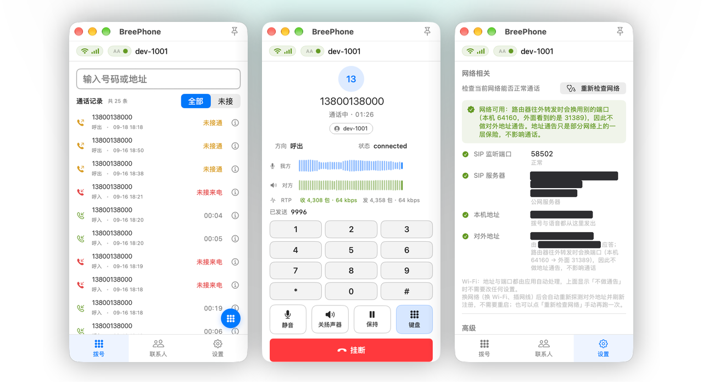
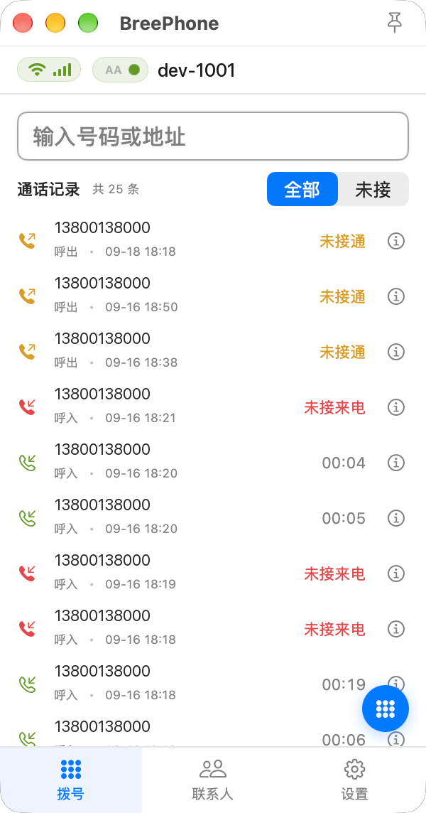
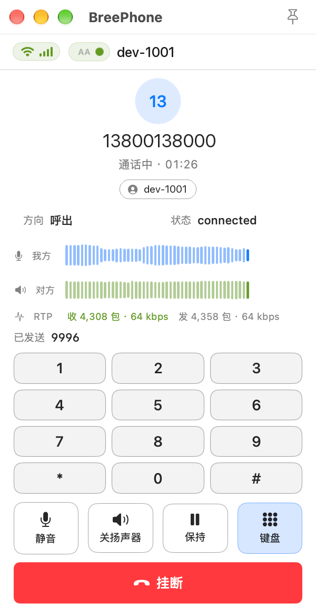
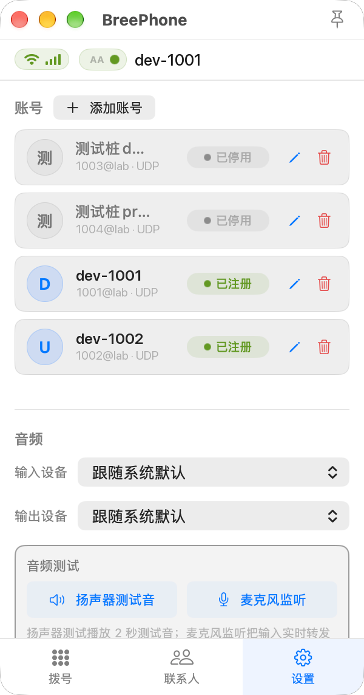
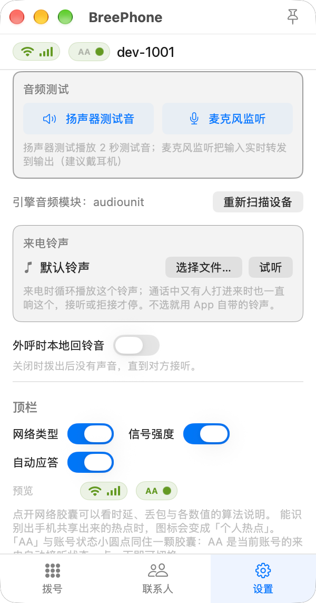
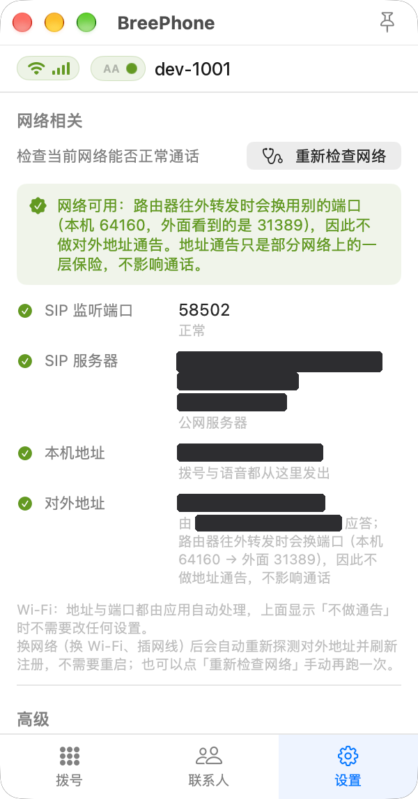
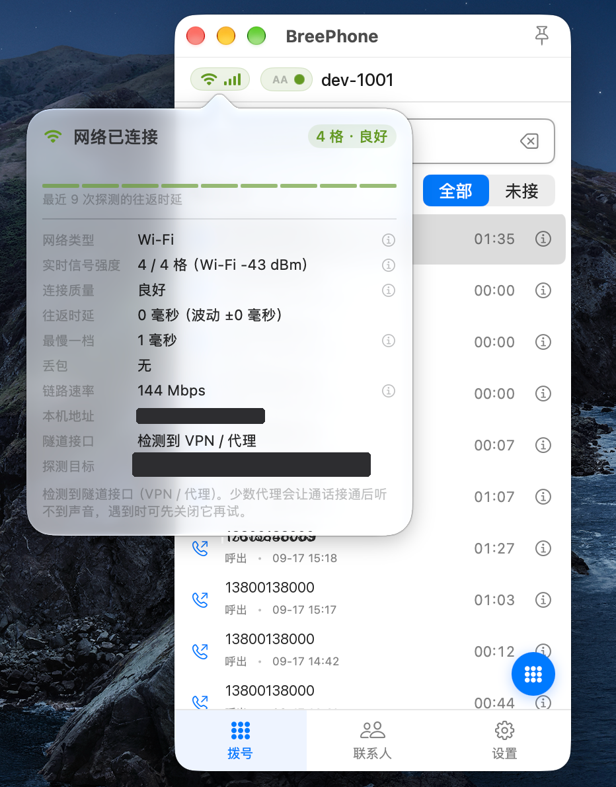
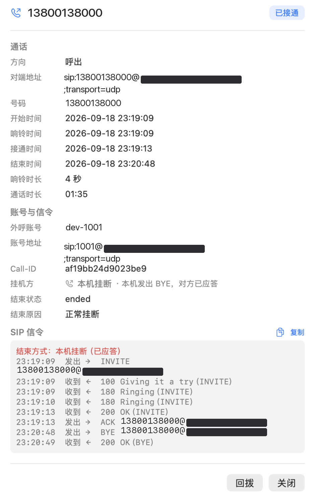

# BreePhone

**macOS 上的原生 SIP 软电话。**

[](https://github.com/zpj80231/breephone/releases/latest)


它就是个正常的 macOS 应用：装完拖进「应用程序」，双击就能打。不用额外装运行时，也没有常驻后台的进程占着内存，关掉就是真的关掉了。



## 下载与安装

> **要 macOS 13 或更高，而且必须是 Apple Silicon。** 只出了 arm64 版本，Intel 机器跑不了，也别指望 Rosetta——包里就没有 x86 的东西。

1. 打开 [**最新版本**](https://github.com/zpj80231/breephone/releases/latest)，下载 `BreePhone-x.y.z.dmg`
2. 双击挂载，把 **BreePhone** 拖进「应用程序」
3. 第一次打开先别双击，**右键 → 打开**（原因见下）

### 为什么第一次要右键打开

应用没买 Apple 开发者账号，也没做公证，所以 Gatekeeper 会拦一下，弹窗大意是
「无法验证开发者」或者「Apple 无法检查其是否包含恶意软件」。

办法很简单：在「应用程序」里右键（或按住 Control 单击）BreePhone，选「打开」，
弹窗里再点一次「打开」。**只需要这一次**，之后就恢复正常了。

如果提示的是「**已损坏**」，同样先用右键打开；仍然不行就去「系统设置 → 隐私与安全性」，
页面往下拉，找到被拦下的那一条，点「仍要打开」。

> 网上那些教你 `xattr -d com.apple.quarantine` 的帖子不用管。右键打开是苹果自己认可的
> 正规路径，做一次就完事，没必要为了这个把 Gatekeeper 关掉。

## 界面

<p align="center">
  
  
  
  
</p>
<p align="center">
  <sub>拨号 &nbsp;·&nbsp; 通话中 &nbsp;·&nbsp; 多账号 &nbsp;·&nbsp; 音频</sub>
</p>

窗口窄窄一条，可以一直贴在屏幕边上。不打电话的时候缩进菜单栏，不占地方。

## 能干什么

**账号**

- 同时挂多个账号，能拖着排序，可以挨个停用；指定其中一个作为默认呼出账号
- UDP / TCP / TLS 三种传输都支持
- 注册间隔、STUN、TURN、ICE 都是按账号单独配的
- 密码和 TURN 凭据放 macOS 钥匙串，不进数据库，也不进日志
- 换 Wi-Fi、插网线、开关 VPN 之后全部自适应，不用重启。

**通话**

- 拨号盘、联系人、通话记录三个页面。一通电话进来，整个窗口切到通话界面
- **静音**是麦克风方向的，对方听不到你；**关扬声器**是播放方向的，对方还听得到你。
  这两个经常被当成一回事，所以界面上干脆分开做
- 支持保持 / 恢复，还有 DTMF 键盘
- 你通话时有人打进来会弹窗，可以接、可以拒（回 `486 Busy Here`），被搁置的那一路点一下能切换过去
- 通话界面有实时电平波纹，呼入呼出两个方向分开显示
- 自动接听按账号开关
- 输入 / 输出音频设备可以指定，通话中改也立刻生效
- 菜单栏常驻，注册状态和通话时长一眼能看到

**数据**

- 全部配置和数据能导出成一个文件（要不要带账号密码自己选），也能导回去。
  导入前会先给一份摘要，你确认了才动
- 启动时查一下 GitHub Release 有没有新版。有就提示你，然后打开发布页——它不会自己下载替换

**排障**

这块做得比一般软电话多一点，下面单独讲。

## 打不通的时候

SIP 软电话最容易卡在两件事上：**拨不通**，和**通了但没声音**。这两个问题光看日志很难猜，
所以在界面里做了三个工具。

<p align="center">
  
  
  
</p>
<p align="center">
  <sub>网络自检 &nbsp;·&nbsp; 顶栏网络胶囊 &nbsp;·&nbsp; SIP 信令回溯</sub>
</p>
**网络自检**（设置 → 网络相关）会把四件事挨个查一遍：本机有没有正常监听、服务器域名解析到了
哪个公网地址、拨号与语音是从哪张网卡发出去的、STUN 拿到的对外地址有没有被改写端口。

自动探测通话相关网络是否可用，再以简要的形式描述出来，比如「路由器往外转发时会换用别的端口，因此不做对外地址通告」。

**顶栏那颗网络胶囊 ** 常驻显示网络类型和信号强度。点开是一张详情卡：往返时延、波动、最慢一档、
丢包、链路速率、出口网卡，还有是否检测到 VPN / 代理。每一项旁边的 `ⓘ` 点开是这一项的具体
算法说明，而不是一句「良好」就完了。

**SIP 信令回溯 **在通话记录详情里。它不是把日志原文糊上去，而是按报文的实际收发方向归纳的：

- 呼出后一个回包都没有 → 信令根本没出去
- 只回了 `100 Trying` 就没下文 → INVITE 多半被中间设备吞了
- 收到 `200 OK` 但没发出 ACK → 问题通常在媒体地址上
- 当然，通话界面也会实时显示 RTP 媒体流的收发情况，是我方流没发出去，还是对方流没发过来，一眼就能看出

同一页还会写明是谁先挂的、结束状态和结束原因。回看一通失败的通话，几秒钟够了。

## 常见问题

<details>
<summary><b>电话接通了，但听不到对方的声音（或者只有单通）</b></summary>

先打开 **设置 → 网络相关 → 重新检查网络**，看那四行结论：

- 「对外地址」是**无应答** → 这台机器到所有 STUN 服务器都不通。先换个网络
  （比如手机热点）确认是网络问题还是配置问题。
- 「对外地址」拿到的是**内网地址** → 运营商的大内网。这种情况下应用会主动放弃地址通告，
  能不能打通就取决于对端和服务器怎么配了。
- 四项都是绿的但依然没声音 → 打开 **设置 → 高级 → 打开日志文件夹**，在 `breephone.log` 里找
  `[RTP TX]` 和 `[RTP RX]`：如果本机发得出去、却收不到包，说明对端的媒体根本没到你这儿，
  问题在中间链路上，不在你这。

还有一点：**「SIP 监听端口」显示的如果不是 5060，不用管它。** 这是刻意设计的——
实测固定用 5060 的时候，对端的媒体地址反而更容易被中间设备改写，结果就是更容易没声音。

</details>

<details>
<summary><b>开着 VPN 就注册不上</b></summary>

这类问题的根子在于「套接字被钉死在了启动那一刻的网卡上」。本应用绑的是通配地址，
源地址交给内核按路由自己选，所以开关 VPN 不会再导致注册失败。

万一还是注册不上：换网络之后它会自动重试（大约 2.5 分钟里按递增间隔重发 7 次），
你也可以到 **设置 → 账号** 手动点一次重新注册。

</details>

<details>
<summary><b>支持哪些音频编码？</b></summary>

按协商优先级排：

| 编码 | 说明 |
|---|---|
| `opus/48000/2` | 48 kHz 全带，抗丢包最好 |
| `G722/16000/1` | 宽带 16 kHz |
| `PCMU` | G.711 µ-law，兼容性最好 |
| `PCMA` | G.711 A-law |
| `L16/44100/2`、`L16/44100/1` | 未压缩线性 PCM，码率很高，只在对方只认它的时候才用得上 |

在账号设置里可以勾选和排序。

</details>

<details>
<summary><b>换电脑怎么迁移？</b></summary>

**设置 → 数据 → 导出数据** 会生成一个备份文件，里面是全部账号、联系人、通话记录和设置
（默认包含账号密码，自己保管好）。在新机器上装好 BreePhone，用 **导入数据** 选中它就行。
导入前会先给你看一份摘要，导入方式可以选整体覆盖或合并。

</details>

<details>
<summary><b>有 Intel Mac / Windows / Linux 版本吗？</b></summary>

目前只有 Apple Silicon。Intel 版得把底层依赖整套重编一遍，暂时没这个计划；
其它平台也不在考虑范围内。

</details>

<details>
<summary><b>能用命令行或脚本发起呼叫吗？</b></summary>

可以，应用注册了 `bree://` 协议，浏览器、脚本或者别的 App 都能触发：

```
bree://call/1002
bree:1002
bree://hangup
```

</details>

## 数据放在哪

| 内容 | 位置 |
|---|---|
| 账号、联系人、通话记录 | `~/Library/Application Support/BreePhone/breephone.sqlite` |
| 日志 | `~/Library/Application Support/BreePhone/breephone.log`（轮转后是 `.log.1`） |
| 账号密码、TURN 密码 | 系统「钥匙串访问」里的 `sip.<UUID>` / `sip.<UUID>.turn` |
| 界面设置 | `UserDefaults`（`com.breephone.app`） |

日志**只写本地文件**，刻意不写系统统一日志。因为里面会有通话号码、服务器地址和 SIP 报文，
落到 `Console.app` 那种谁都能翻的持久库里并不合适。

日志有大小上限，会自动轮转，上限在 **设置 → 高级** 里能改。

## 关于更新

每次启动它会去这个仓库的 Releases 查一下最新版本（GitHub 官方接口，匿名调用，不用登录）。
有新版本就弹窗提示你，点一下打开发布页。

**它不会自己下载替换自己。** 在没有签名和公证的前提下，让程序自动替换自己的可执行文件，
风险比收益大得多。

## 关于源码

这个仓库只放三样东西：说明文档、官网、发布出去的二进制。应用源码目前没有公开。

## 反馈

用着有问题就 [提个 Issue](https://github.com/zpj80231/breephone/issues)。
如果能顺手把 `breephone.log` 一起发上来，定位会快很多——发之前记得看一眼里面
有没有你不想公开的号码和服务器地址。
